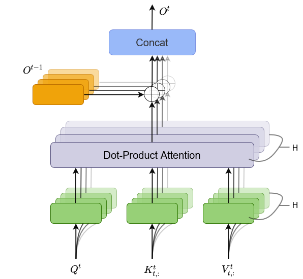
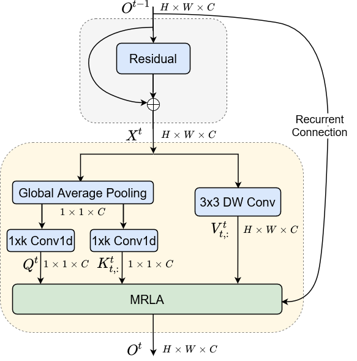

# MRLA-Net
Multi-head Recurrent Layer Attention for Vision Network






## Installation

### Base environment for ImageNet Classification

1. Create a conda virtual environment and activate it.
    ```shell
    conda create -n pytorch python=3.7 -y
    conda activate pytorch
    ```

2. PyTorch versions 1.4, 1.5.x, 1.6, 1.7.x, and 1.8 are supported
    ```shell
    # CUDA 11.1
    conda install pytorch==1.8.0 torchvision==0.9.0 torchaudio==0.8.0 cudatoolkit=11.1 -c pytorch -c conda-forge
    
    # CUDA 10.1
    conda install pytorch==1.7.1 torchvision==0.8.2 torchaudio==0.7.2 cudatoolkit=10.1 -c pytorch

    # CUDA 10.2
    conda install pytorch==1.7.1 torchvision==0.8.2 torchaudio==0.7.2 cudatoolkit=10.2 -c pytorch
    ```


## Quick Start

### Train with ResNet on ImageNet-1K

#### - Use single node or multi node with multiple GPUs

Use multi-processing distributed training to launch N processes per node, which has N GPUs. This is the fastest way to use PyTorch for either single node or multi node data parallel training.

  ```bash
  python train.py -a {model_name} --b {batch_size} --multiprocessing-distributed --world-size 1 --rank 0 {imagenet-folder with train and val folders}
  ```

#### - Specify single GPU or multiple GPUs

  ```bash
  CUDA_VISIBLE_DEVICES={device_ids} python train.py -a {model_name} --b {batch_size} --multiprocessing-distributed --world-size 1 --rank 0 {imagenet-folder with train and val folders}
  ```

### Testing

To evaluate the best model

  ```bash
  python train.py -a {model_name} --b {batch_size} --multiprocessing-distributed --world-size 1 --rank 0 --resume {path to the best model} -e {imagenet-folder with train and val folders}
  ```
  
### MMDetection

We provide models and config files for MMDetection:

- resnet_mrla.py in './mmdetection/mmdet/models/backbones/', and import the model in the __init__.py file.
- base config files in './mmdetection/configs/_base_/models/'
- config files in the folders named by the corresponding folders

Note that the config files of the latest version of MMDetection are a little different from previous one. Specifically, 


### Train with EfficientNet on ImageNet-1K


### Train with DeiT on ImageNet-1K


### Train with CeiT on ImageNet-1K
